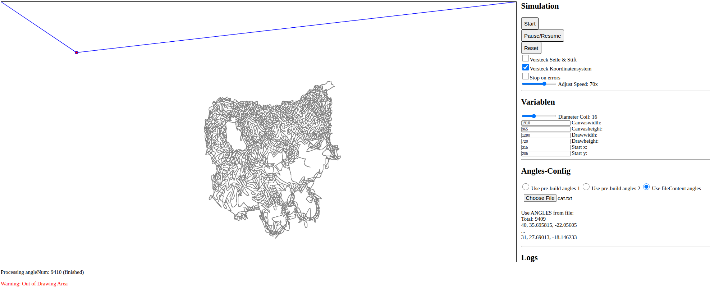

# 🤖🖊️ Arduino Drawing on Whiteboard
As part of a programming lab course in my fifth semester, I worked together with a fellow student to develop a project.
This repository contains only our contribution as Group 5 to the overall project. 

The complete project, including the work of all groups, can be found [in this repo](https://github.com/Tim3399/Programmierpraktikum). Also, a detailed manual is available there as file `Anleitung_Praktikum_Abgabe.pdf`.

> Note that this is a project in german. Code written might be in english.

## 👥 My Group's responsibility
Me and my partner's focus within the group project was the simulation of the drawing process. For this, we wrote a simple HTML GUI with some CSS and created the logic with JavaScript.

